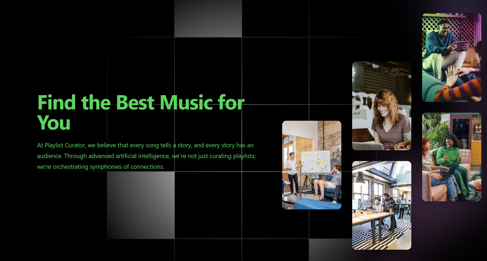

# playlistcurator

Website Deployed!: https://kukw69e502.execute-api.us-west-2.amazonaws.com/




## Description 
At Playlist Curator, we believe that every song tells a story, and every story has an audience. Through advanced artificial intelligence, we're not just curating playlists; we're orchestrating symphonies of connections.


# How to use Playlist Curator
1. Run the app
  - Run through the website
  - Run locally (check below for the instructions)
2. Authenticate
  - Playlist curator needs your Spotify authentication to run the necessary processes (Spotify API processes)
3. Explore the page
  - Compare your playlists with your friends
  - Find playlists that are similar to your tastes
  - Create your new playlists


## How to run locally:
1. Clone the repo
   ```git clone https://github.com/Tofulati/playlistcurator.git```
2. Download the required libraries
   ```npm install```
   - If this does not work you will have to ```npm install {library}``` for all the required libraries listed as an error
3. Run the app
   ```npm run dev```
4. Open the app link in your browser [ctrl + click] 


## Team
- Addy Chen (DevOps)
- Hajin Park (ML Modelling)
- Patrick Park (Frontend)
- Albert Ho (Frontend)


## Plan
1. make an account/ login to playlist curator
2. login to spotify
3. store metadata from spotify
4. grab playlist and songs
